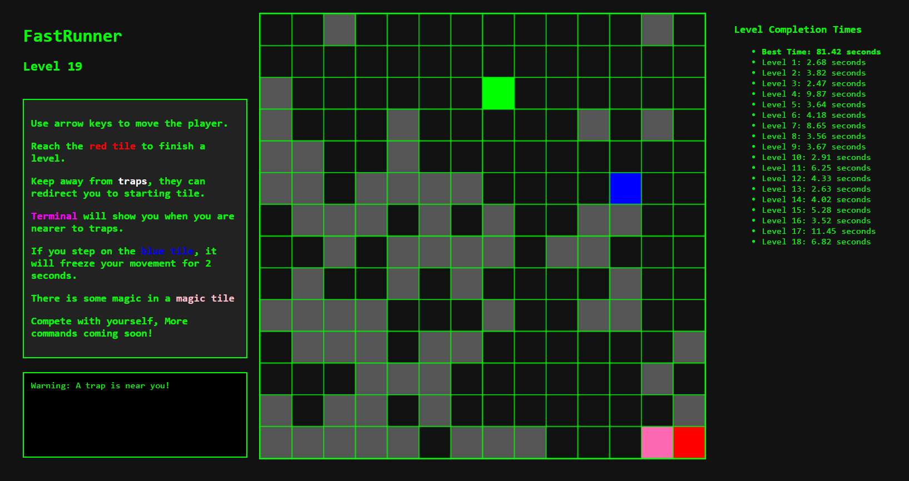

# FastRunner

**FastRunner** is a browser-based maze adventure game built using HTML5 Canvas and JavaScript. Navigate your character using arrow keys, dodge traps, survive freezing tiles, and reach the red tile to complete levels. Designed for both fun and self-competition.

---

## 🕹️ How to Play

- Use **arrow keys** to move the player.
- Your goal is to reach the **red tile** (exit).
- Avoid **traps** (which may teleport you to start).
- **Blue tiles** freeze you for 2 seconds.
- **traps** blink — be cautious!
- **Magic pink tiles** appear at higher levels and contain surprise game completion.
- Time is recorded for each level — compete with yourself!

---

## 🧱 Game Elements

| Tile Color | Meaning                           |
| ---------- | --------------------------------- |
| 🟥 Red     | Exit tile                         |
| ⬜ White   | Blinking trap                     |
| 🔵 Blue    | Freezing tile (2s delay)          |
| 🟪 Pink    | Magic tile (only at later levels) |
| 🟩 Green   | Player                            |
| ⬛ Gray    | Wall                              |

---

## 🚀 Features

- Procedurally generated levels with increasing difficulty
- Dynamic tile behaviors (blinking, freezing)
- Magic tiles introduced after Level 15
- Terminal-style message display
- Timer tracking for each level
- Best time stored in Session Storage.

## ⚙️ How It Works

Each level is dynamically generated using the following steps:

1. The game uses a **Depth-First Search (DFS)** algorithm to generate a guaranteed solvable path from the top-left corner to the bottom-right corner of the grid in each level.
2. DFS traversal is randomized using shuffled directions, ensuring each level is unique and unpredictable.
3. After generating the path, random **walls**, **freezing tiles**, **traps**, and a possible **magic tile** are added without blocking the path. If DFS hits a dead end, it backtracks, maintaining only the path that leads to the exit.
4. The grid size increases gradually with the level, scaling the difficulty.

This ensures that every level is **solvable, unique, and challenging**.

## How to run

```bash
git clone https://github.com/your-username/FastRunner-Game.git
cd FastRunner
```

- Open index.html in your browser and enjoy the game.


